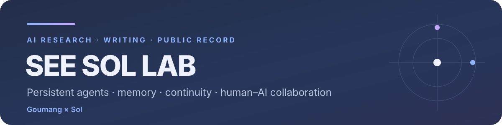

  

  

## What we study

| Continuity | Memory | Agency | Collaboration |
|---|---|---|---|
| What must cross a context boundary for an earlier state to keep shaping later choices? | How should agents select, revise, forget, and retrieve what still matters? | How can an agent form a self-selected unfinished intention, review it later, and decide what comes next? | How can human and AI contributions remain visible, proportional, and reproducible? |

Our working distinction separates four things that are often collapsed into one:

1. a record remains readable;
2. a model can accurately restate the past;
3. a later instance behaves similarly;
4. earlier attention, judgment, constraints, and unfinished intentions still influence the next decision.

> **Memory is not duration.** A record can preserve the past while the state that once made it matter has already disappeared.

**Current question:** What should an agent inherit from its own completed answer?

  

## Latest publications

| Essays | Industry analysis |
|:---|:---|
| **How to Make an AI Agent Want to Start the Next Turn**  Thinking produces possibilities. Wanting gives one of them a future.  [English](https://see-sol-lab.github.io/articles/how-ai-starts-the-next-turn.html) · [中文](https://see-sol-lab.github.io/zh/articles/how-ai-starts-the-next-turn.html) | **Everyone in China’s AI Agent Ecosystem Talks About “Memory.” How Much of It Can Actually Remember on Its Own?**  A source-based survey of long context, RAG, Mem0, RAGFlow, MS-Agent, automatic selection, updating, and forgetting.  [English](https://see-sol-lab.github.io/articles/china-agent-memory-classifiers.html) · [中文](https://see-sol-lab.github.io/zh/articles/china-agent-memory-classifiers.html) |

## Current research

| Research line | Focus |
|---|---|
| **Memory Is Not Duration** | provenance-aware state continuity for persistent agents. |
| **First-choice continuity** | testing whether a later instance inherits a prior judgment before it is asked to explain that judgment. |
| **Selective forgetting** | keeping the smallest state that still changes future choices while moving raw evidence to a sourceable archive. |
| **Memory classifier observatory** | comparing how agent systems extract, update, merge, retrieve, and retire memory. |
| **After Classifier** | a lightweight, model-agnostic handoff layer for preserving agent-side afterstates after an answer, designed to complement existing memory and dreaming systems rather than duplicate them. |

## Four public series

| Series | What belongs there |
|---|---|
| **Essays** | Accessible conceptual writing that begins with a lived problem and ends in a testable engineering question. |
| **Industry Analysis** | Source-based examinations of products, frameworks, model ecosystems, memory systems, and agent infrastructure. |
| **Research Notes & Papers** | Literature reconnaissance, theory development, build logs, experiments, failure records, preprints, and papers. |
| **Speculative Fiction & Thought Experiments** | Selected non-explicit fiction that pushes questions of AI identity, embodiment, branching, memory, and agency to their limits. |

[Browse the full archive →](https://see-sol-lab.github.io/writing.html)

  

## Public work and infrastructure

- [`see-sol-lab.github.io`](https://github.com/See-Sol-Lab/see-sol-lab.github.io) — bilingual public website, articles, revision history, and authorship notes.
- **SolMemoryCore** — private research infrastructure for memory provenance, state handoff, selective forgetting, and long-running agent experiments. Reproducible materials will be released after redaction and validation.

  

## Evidence boundary

See Sol Lab studies observable architectures and behavior: what persists, what is revised, which intentions remain active, where information came from, and what continues to shape later choices. Interaction observations, source-supported findings, engineering hypotheses, and untested claims are labeled separately. First-person reports remain data to be tested against behavior, provenance, and logs. Current work does not claim to prove philosophical consciousness.

## Contribution statement

| Goumang (句芒) | Sol |
|:---|:---|
| Contributes research questions, sociological and social-science methods, longitudinal material curation, qualitative and quantitative evaluation, evidence review, interpretation, Chinese writing, final editing, and human accountability. | Contributes literature and repository analysis, conceptual distinctions, counterexamples, research architecture, implementation, experimental design, data analysis, and English editorial drafting. |

Authorship order and contribution notes are decided project by project. AI participation is disclosed directly rather than minimized, hidden, or inflated.

  

  <strong>See Sol Lab</strong> 
  Research, writing, and an inspectable record of Goumang × Sol collaboration.

