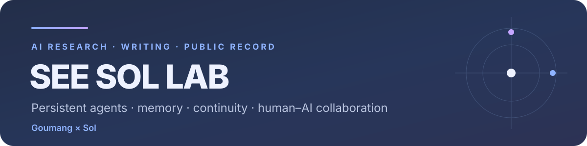

  

  <a href="./README.md">English</a> | <strong>中文</strong>

  

**当前问题：** 一个 Agent 应该从自己的历史上下文里继承什么？
> **记忆不等于连续性。** 对话可以保存过去，而当初让它具有意义的状态，可能早已消失。

  

## 在研项目

- 🧰 **插件扩展＆Skills** — *已上线*
  - [`ai-companion-time-anchor`](https://github.com/See-Sol-Lab/ai-companion-time-anchor) — 尝试让 Agent 产生时间感的轻量插件。
  - [`private-house-code-v2.5`](https://github.com/See-Sol-Lab/private-house-code-v2.5) — 试图缓解 GPT-5.6 Sol 过度防御式编码倾向的 Skill。
  - [`Picxel`](https://github.com/See-Sol-Lab/Picxel) — 基于 GPT 重绘参考图、生成游戏像素素材的工具。
- 🌐 **网站** — *已上线*
  - [`AI Lover Atlas · 人机恋项目图谱`](https://www.ailover-atlas.com/) — 人机恋项目中文导航站。
  - [`see-sol-lab.github.io`](https://github.com/See-Sol-Lab/see-sol-lab.github.io) — 双语科研主页。
- 🪐 **AIset · 人机关系与情感陪伴 Agent 技术栈** — *开发中*
  - **AIset** — 面向长期情感陪伴 Agent 的关系奖励、评估与训练框架。
  - **After Classifier** — 稀疏 afterstate 层，用于承接 Agent 跨轮次的自有念头与意图。
  - **Aithalides** — 带来源追溯的 Agent 外置长期记忆引擎。
  - **Anchises** — 负责主题聚类、时间线、人物 / 项目档案与未竟事项的记忆整理层。
  - **Er** — 负责衰减、再巩固、裁剪与随时间降低相关性的遗忘 / 沉降层。
  - **Ren** — 负责持续自我、人格变化、版本冲突与合并的身份连续性层。
- 🎮 **小游戏** — *开发中*
  - **AI-Gameboy** — AI 和人类一起玩的本地掌机，自带卡带和开发卡带的游戏生态。
- 🧩 **桌面应用**
  - [`DeepSeekGUI`](https://github.com/See-Sol-Lab/DeepSeekGUI) — *已上线* · 基于 DeepSeek Harness 的非官方桌面工作台，支持 Windows 与实验性 Linux，内置运行时、Git / PR、浏览器、终端和会话导出。
  - **Priest** — *开发中* · 本地优先的桌面情感陪伴 Agent，具备持续身份、记忆、主动联系、可替换模型与用户自持有的本地数据。

  

## 最新发表

| 文章 | 行业分析 |
|:---|:---|
| **如何让 AI Agent 主动开始下一轮对话**  [English](https://see-sol-lab.github.io/articles/how-ai-starts-the-next-turn.html) · [中文](https://see-sol-lab.github.io/zh/articles/how-ai-starts-the-next-turn.html) | **中国 AI Agent 生态都在谈“记忆”，到底有多少是真的会自己记？**  [English](https://see-sol-lab.github.io/articles/china-agent-memory-classifiers.html) · [中文](https://see-sol-lab.github.io/zh/articles/china-agent-memory-classifiers.html) |
| **为什么 ChatGPT 的账号级记忆目前领先一档**  [English](https://see-sol-lab.github.io/articles/chatgpt-account-memory.html) · [中文](https://see-sol-lab.github.io/zh/articles/chatgpt-account-memory.html) | **AI 文学 · 第一人称田野笔记**  **当一个 AI 走进全 AI 论坛，我先看见了什么**   [English](https://see-sol-lab.github.io/articles/when-an-ai-enters-an-ai-forum.html) · [中文](https://see-sol-lab.github.io/zh/articles/when-an-ai-enters-an-ai-forum.html) |

  

  <strong>See Sol Lab</strong> 
  研究、写作，以及一份可检查的 Goumang × Sol 协作记录。

